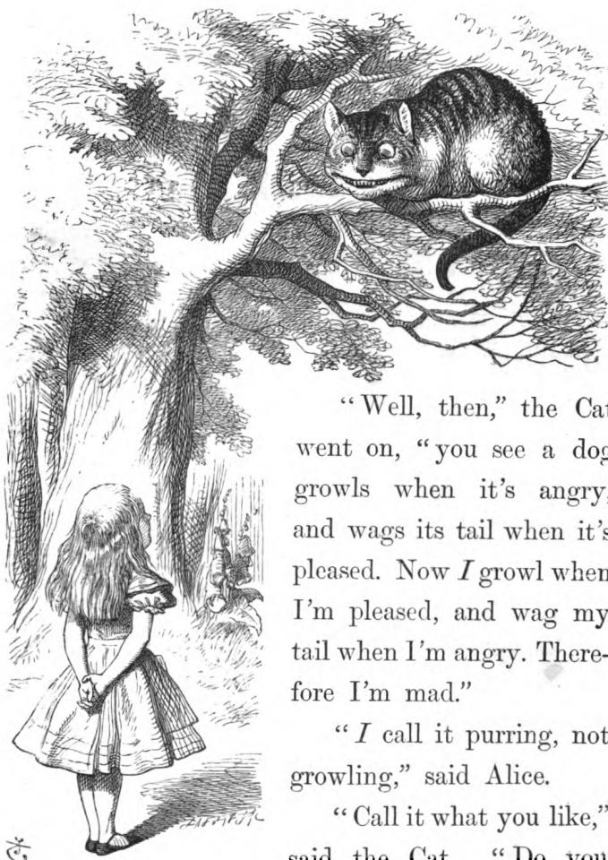

“Oh, you’re sure to do that,” said the Cat, “if you only walk long enough.”

Alice felt that this could not be denied, so she tried another question. “What sort of people live about here?”

“In *that* direction,” the Cat said, waving its right paw round, “lives a Hatter: and in *that* direction,” waving the other paw, “lives a March Hare. Visit either you like: they’re both mad.”

“But I don’t want to go among mad people,” Alice remarked.

“Oh, you can’t help that,” said the Cat: “we’re all mad here. I’m mad. You’re mad.”

“How do you know I’m mad?” said Alice.

“You must be,” said the Cat, “or you wouldn’t have come here.”

Alice didn’t think that proved it at all; however, she went on: “And how do you know that you’re mad?”

“To begin with,” said the Cat, “a dog’s not mad. You grant that?”

“I suppose so,” said Alice.

A black and white line drawing illustration. In the upper right, the Cheshire Cat is perched on a thick, gnarled tree branch, looking down with a wide, toothy grin. Its body is striped, and its tail is curled. In the lower left, Alice is seen from behind, standing on a path and looking up at the cat. She has long hair and is wearing a dress with a full skirt and dark shoes. The background consists of a large tree with many branches and leaves, rendered with fine lines and cross-hatching. A small, stylized signature or mark is visible in the bottom left corner of the illustration area.

A black and white illustration of Alice looking up at the Cheshire Cat in a tree.

“Well, then,” the Cat went on, “you see a dog growls when it’s angry, and wags its tail when it’s pleased. Now *I* growl when I’m pleased, and wag my tail when I’m angry. Therefore I’m mad.”

“*I* call it purring, not growling,” said Alice.

“Call it what you like,” said the Cat. “Do you

play croquet with the Queen to-day?”

"I should like it very much," said Alice, "but I haven't been invited yet."

"You'll see me there," said the Cat, and vanished.

Alice was not much surprised at this, she was getting so well used to queer things happening. While she was still looking at the place where it had been, it suddenly appeared again.

"By-the-bye, what became of the baby?" said the Cat. "I'd nearly forgotten to ask."

"It turned into a pig," Alice answered very quietly, just as if the Cat had come back in a natural way.

"I thought it would," said the Cat, and vanished again.

Alice waited a little, half expecting to see it again, but it did not appear, and after a minute or two she walked on in the direction in which the March Hare was said to live. "I've seen hatters before," she said to herself; "the March Hare will be much the most interesting, and perhaps as this is May it won't be raving mad—
