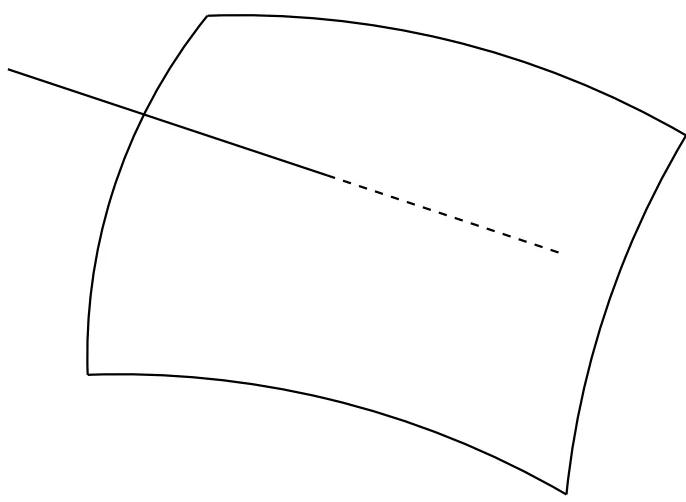

A connected algebraic set with two irreducible components.

COROLLARY 2.32. The radical of an ideal a in k[X], ... ,X¡] is a finite intersection of prime ideals, rad(a) = \$1 ( ... ( p ... If there are no inclusions among the p ;, then the p; are uniquely determined up to order (and they are exactly the minimal prime ideals containing a).

PROOF. Write V(a) as a union of its irreducible components, V(a) = Vi, and let p; = I(V;). Then rad(a) = \$1 ( ... ∩ Pn because they are both radical ideals and

$$V(\text{rad}(\mathfrak{a})) = V(\mathfrak{a}) = \bigcup V(\mathfrak{p}\_i) \stackrel{2.10b}{=} V(\bigcap\_i \mathfrak{p}).$$

The uniqueness similarly follows from the proposition.

## Remarks

An irreducible topological space is connected, but a connected topological space need not be irreducible. For example, the union of two surfaces in 3-space intersecting along a curve is reducible, but connected.

2.33. An algebraic subset V of A4 is disconnected if and only if there exist radical ideals a and b such that V is the disjoint union of V(a) and V(b), so

$$\begin{cases} V = V(\mathfrak{a}) \cup V(\mathfrak{b}) = V(\mathfrak{a} \cap \mathfrak{b}) & \Longleftrightarrow \mathfrak{a} \cap \mathfrak{b} = I(V) \\\emptyset = V(\mathfrak{a}) \cap V(\mathfrak{b}) = V(\mathfrak{a} + \mathfrak{b}) & \Longleftrightarrow \mathfrak{a} + \mathfrak{b} = k[X\_1, \dots, X\_n]. \end{cases}$$

Then

$$k[V] \simeq \frac{k[X\_1, \ldots, X\_n]}{\mathfrak{a}} \times \frac{k[X\_1, \ldots, X\_n]}{\mathfrak{b}}$$

by Theorem 1.1.

2.34. A Hausdorff space is noetherian if and only if it is finite, in which case its irreducible components are the one-point sets.

2.35. In k[X], ... , Xn], a principal ideal (f) is radical if and only if f is square-free, in which case f is a product of distinct irreducible polynomials, f = fj ... f,, and (f)=(f1)n ... n(fr).

D