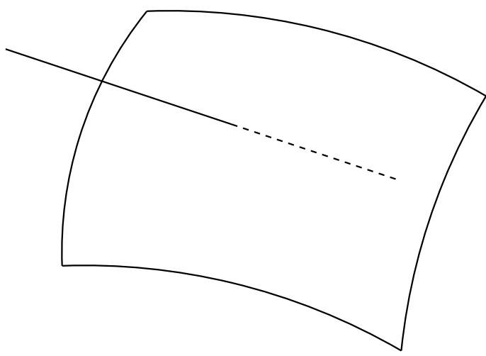

A connected algebraic set with two irreducible components.

C 2.32. *The radical of an ideal in* [1, … ,] *is a nite intersection of prime ideals,* rad() = 1 … *. If there are no inclusions among the , then the are uniquely determined up to order (and they are exactly the minimal prime ideals containing ).*

P. Write () as a union of its irreducible components, () = =1 , and let = (). Then rad() = 1 … because they are both radical ideals and

$$V(\text{rad}(\mathfrak{a})) = V(\mathfrak{a}) = \bigcup V(\mathfrak{p}\_l) \stackrel{2.10b}{=} V(\bigcap\_l \mathfrak{p}).$$

The uniqueness similarly follows from the proposition. 2

## *Remarks*

An irreducible topological space is connected, but a connected topological space need not be irreducible. For example, the union of two surfaces in 3-space intersecting along a curve is reducible, but connected.

2.33. An algebraic subset of is disconnected if and only if there exist radical ideals and such that is the disjoint union of () and (), so

$$\begin{cases} V = V(\mathfrak{a}) \cup V(\mathfrak{b}) = V(\mathfrak{a} \cap \mathfrak{b}) & \Longleftrightarrow \mathfrak{a} \cap \mathfrak{b} = I(V) \\ \emptyset = V(\mathfrak{a}) \cap V(\mathfrak{b}) = V(\mathfrak{a} + \mathfrak{b}) & \Longleftrightarrow \mathfrak{a} + \mathfrak{b} = k[X\_1, \dots, X\_n]. \end{cases}$$

Then

$$k[V] \simeq \frac{k[X\_1, \ldots, X\_n]}{\mathfrak{a}} \times \frac{k[X\_1, \ldots, X\_n]}{\mathfrak{b}}$$

by Theorem 1.1.

2.34. A Hausdor space is noetherian if and only if it is nite, in which case its irreducible components are the one-point sets.

2.35. In [1, … ,], a principal ideal () is radical if and only if is square-free, in which case is a product of distinct irreducible polynomials, = 1 … , and ()=(1) … ().