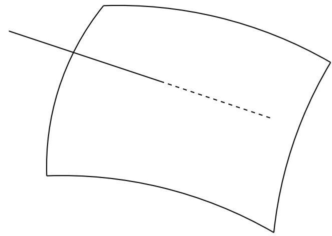

A connected algebraic set with two irreducible components.

COROLLARY 2.32. The radical of an ideal $\mathfrak{a}$ in $k[X_1, ..., X_n]$ is a finite intersection of prime ideals, $rad(\mathfrak{a}) = \mathfrak{p}_1 \cap ... \cap \mathfrak{p}_n$. If there are no inclusions among the $\mathfrak{p}_i$, then the $\mathfrak{p}_i$ are uniquely determined up to order (and they are exactly the minimal prime ideals containing $\mathfrak{a}$).

_1 Vi, and let PROOF. Write V(a) as a union of its irreducible components, V(a) = | p: = I(V;). Then rad(a) = \$1 ( ... ∩ px because they are both radical ideals and

$$V(\mathrm{rad}(\mathfrak{a})) = V(\mathfrak{a}) = \bigcup V(\mathfrak{p}_{i}) = V(\bigcap_{i} \mathfrak{p}).$$

The uniqueness similarly follows from the proposition.

## Remarks

An irreducible topological space is connected, but a connected topological space need not be irreducible. For example, the union of two surfaces in 3-space intersecting along a curve is reducible, but connected.

2.33. An algebraic subset $V$ of $A^n$ is disconnected if and only if there exist radical ideals 

$$\begin{cases} V = V(\mathfrak{a}) \cup V(\mathfrak{b}) = V(\mathfrak{a} \cap \mathfrak{b}) & \Longleftrightarrow \mathfrak{a} \cap \mathfrak{b} = I(V) \\ \emptyset = V(\mathfrak{a}) \cap V(\mathfrak{b}) = V(\mathfrak{a} + \mathfrak{b}) & \Longleftrightarrow \mathfrak{a} + \mathfrak{b} = k[X_1, ..., X_n]. \end{cases}$$

Then

$$k[V] \simeq \frac{k[X_{1},...,X_{n}]}{\mathfrak{a}} \times \frac{k[X_{1},...,X_{n}]}{\mathfrak{b}}$$

by Theorem 1.1.

2.34. A Hausdorff space is noetherian if and only if it is finite, in which case its irreducible components are the one-point sets.

2.35. In $k[X_1, ..., X_n]$, a principal ideal $(f)$ is radical if and only if $f$ is square-free, in which case $f$ is a product of distinct irreducible polynomials, $f = f_1 ... f_r$, and $(f) = (f_1) \cap ... \cap (f_r)$.