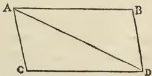

# --- AXIOMATA SIVE LEGES MOTUS ---

### Lex. I.

*Corpus omne perseverare in statu suo quiescendi vel movendi uniformiter in directum, nisi quatenus a viribus impressis cogitur statum illum mutare.*

**P**rojectilia perseverant in motibus suis nisi quatenus a resistentia aeris retardantur & vi gravitatis impelluntur deorsum.

Trochus, cujus partes cohærendo perpetuo retrahunt sese a motibus rectilineis, non cessat rotari nisi quatenus ab aere retardatur. Majora autem Planetarum & Cometarum corpora motus suos & progressivos & circulares in spatiis minus resistentibus factos conservant diutius.

### Lex. II.

*Mutationem motus proportionalem esse vi motrici impressæ, & fieri secundum lineam rectam qua vis illa imprimitur.*

Si vis aliqua motum quemvis generet, dupla duplum, tripla tripulum generabit, sive simul & semel, sive gradatim & successive impressa fuerit. Et hic motus quoniam in eandem semper plagam cum vi generatrice determinatur, si corpus antea movebatur, motui ejus vel conspiranti additur, vel contrario subducitur, vel oblique oblique adjicitur, & cum eo secundum utriusq; determinationem componitur.

Lex. III.

*Actioni contrariam semper & æqualem esse reactionem : sive corporum duorum actiones in se mutuo semper esse æquales & in partes contrarias dirigi.*

Quicquid premit vel trahit alterum, tantundem ab eo premitur vel trahitur. Siquis lapidem digito premit, premitur & hujus digitus a lapide. Si equus lapidem funi allegatum trahit, retrahetur etiam & equus æqualiter in lapidem: nam funis utrinq; distensus eodem relaxandi se conatu urget Equum versus lapidem, ac lapidem versus equum, tantumq; impediet progressum unius quantum promovet progressum alterius. Si corpus aliquod in corpus aliud impingens, motum ejus vi sua quomodocunq; mutaverit, idem quoque vicissim in motu proprio eandem mutationem in partem contrariam vi alterius ( ob æqualitatem pressionis mutux ) subibit. His actionibus æquales fiunt mutationes non velocitatum sed motuum, ( scilicet in corporibus non aliunde impeditis : ) Mutationes enim velocitatum, in contrarias itidem partes factæ, quia motus æqualiter mutantur, sunt corporibus reciproce proportionales.

### Corol. I.

*Corpus viribus conjunctis diagonalem parallelogrammi eodem tempore describere, quo latera separatis.*

Si corpus dato tempore, vi sola  $M$ , ferretur ab  $A$  ad  $B$ , & vi sola  $N$ , ab  $A$  ad  $C$ , compleatur parallelogrammum  $ABDC$ , & vi utraq; feretur id eodem tempore ab  $A$  ad  $D$ . Nam quoniam vis  $N$  agit secundum lineam

$AC$  ipsi  $BD$  parallelam, hæc vis nihil mutabit velocitatem accedendi ad lineam illam  $BD$  a vi altera genitam. Accedet igitur corpus eodem tempore ad lineam  $BD$  sive vis  $N$  imprimatur, sive non, atq; adeo in fine illius temporis reperietur alicubi in linea illa
