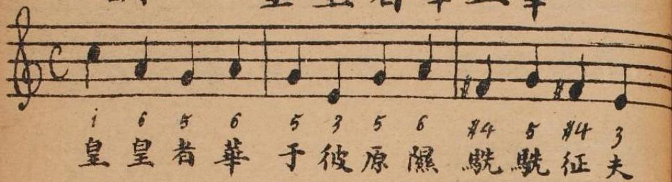
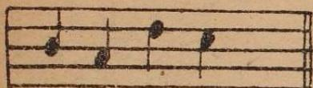
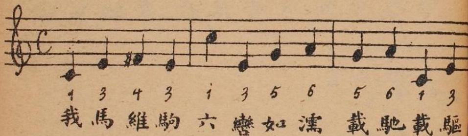
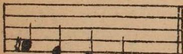

崧高 八章之一

烝民 八章之一

抑 十二章之二

駉 三章之一

太史公有言古詩三千餘篇孔子取三百五篇皆弦歌之以求合於韶武雅頌之音蓋無一篇不可歌亦無一人不能歌也秦漢以還言詩者詳文義而略音節漢末雅樂郎杜夔猶傳鹿鳴騶虞文王伐檀四篇至左延年則僅傳鹿鳴一篇晉後並鹿鳴佚之於是乎歌詩者匙鄭漁仲曰古之詩今之詞曲也若不能歌之但誦其文

說其義可乎諒哉斯言惟是居今日而言古樂非可肌造是編專采古譜庶不失古人詩教之旨

歌必有譜漢藝文志河南周歌聲曲折七篇周謠歌詩聲曲折七十五篇皆樂歌之譜也今既不傳惟朱子儀禮經傳通解有詩樂篇載十二詩譜乃趙彥肅所傳云即開元遺聲毛西河凌次仲紛紛議之然唐去古猶非絕遠而古樂又與唐雅樂相近用李照說今去唐又數百年猶幸有此譜可據以存古樂之彷彿陳蘭甫所謂真可

寶貴者是編錄為上卷

十二詩譜之外惟元儒熊與可瑟譜二卷

元史本傳 瑟譜作瑟賦

C

調 4/4拍

# 皇皇者華五章

1 6 5 6 5 3 5 6 #4 5 #4 3  
 皇 皇 者 華 于 彼 原 隰 駢 駢 征 夫

7 6 2 1  
 每 懷 靡 及

1 3 4 3 1 3 5 6 5 6 1 3  
 我 馬 維 駒 六 轡 如 濡 載 馳 載 驅

4 3 2 1  
 周 爰 咨 諏

四牡五章五句  
 叶音 馬 切 蒲 補 下 切 後 五 母 美 諗 深
